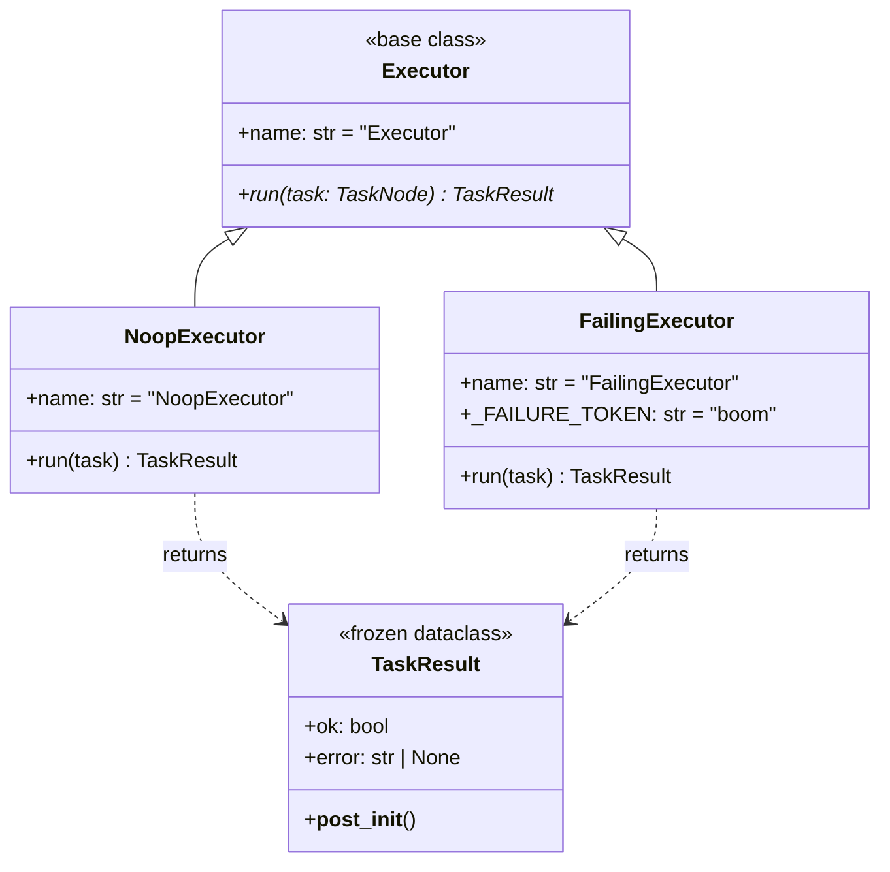
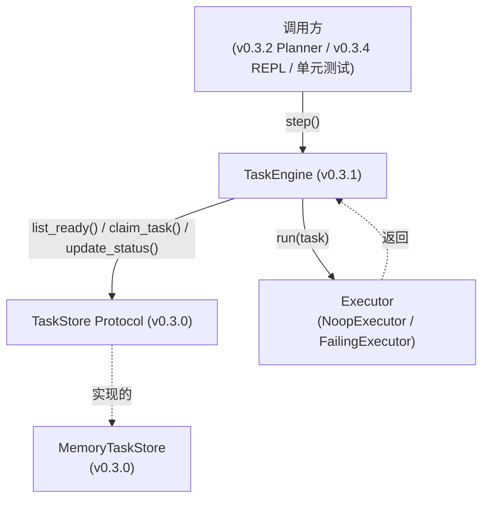
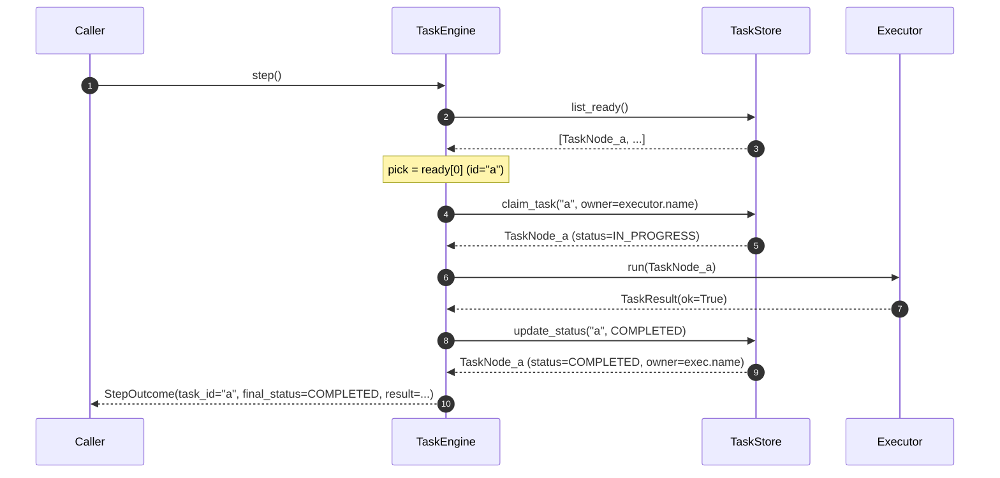
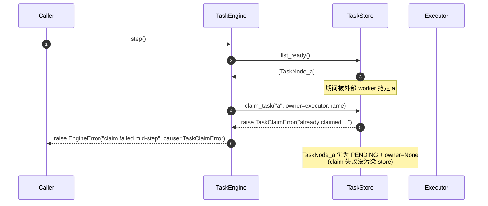
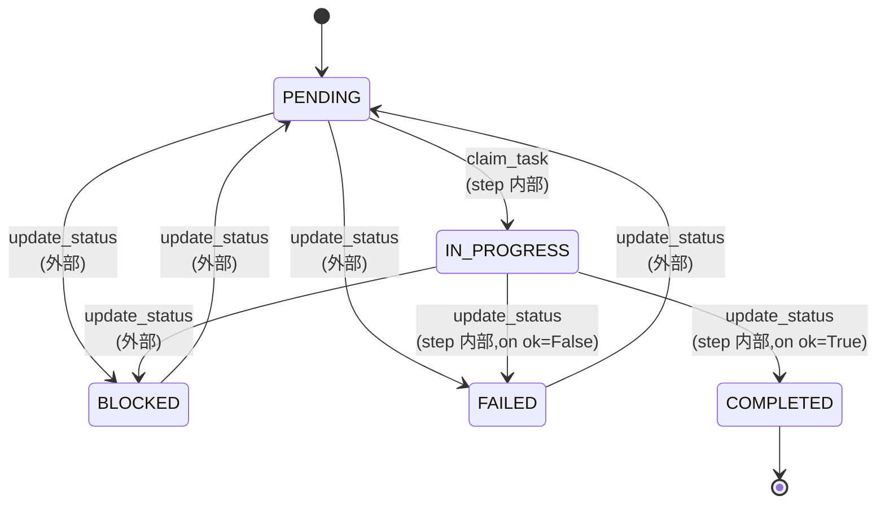
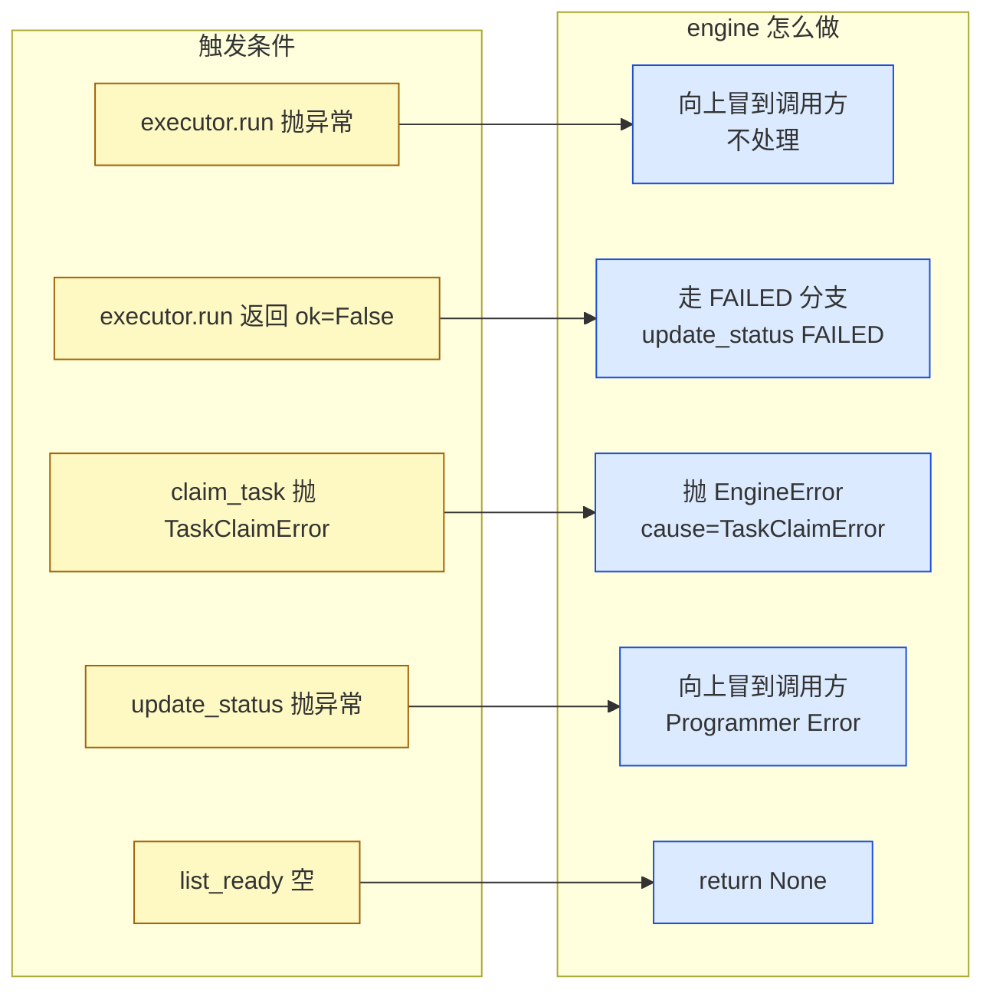
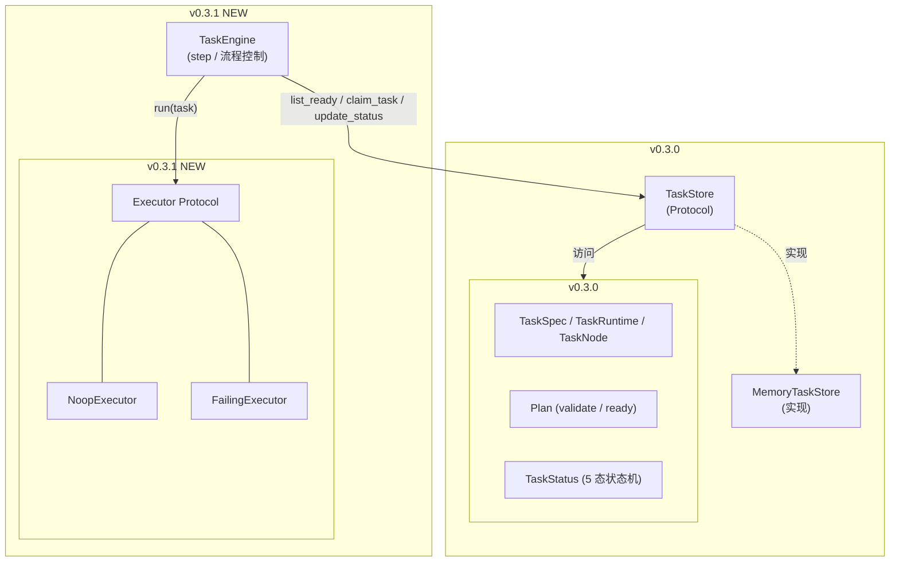

# v0.3.1 — 设计文档 / Design Document

> 在 v0.3.0 数据层之上,加一个**单步驱动的执行循环**,把"调度器要做什么"具象化。
>
> 前置版本: [v0.3.0-design.md](./v0.3.0-design.md)(任务 DAG + TaskStore)
> 后续演进: [v0.3.2-design.md](./v0.3.2-design.md)(Planner 桥接)

---

## 目录 / Table of Contents

1. [一句话定位 / One-liner](#1-一句话定位--one-liner)
2. [本版目标 / Goals](#2-本版目标--goals)
3. [为什么需要这一版 / Motivation](#3-为什么需要这一版--motivation)
4. [新增模块 / New Modules](#4-新增模块--new-modules)
5. [Executor 抽象 / Executor Abstraction](#5-executor-抽象--executor-abstraction)
6. [TaskEngine 单步循环 / TaskEngine.step()](#6-taskengine-单步循环--taskenginestep)
7. [错误模型 / Error Model](#7-错误模型--error-model)
8. [与 v0.3.0 的关系 / Relationship with v0.3.0](#8-与-v030-的关系--relationship-with-v030)
9. [测试覆盖 / Test Coverage](#9-测试覆盖--test-coverage)
10. [后续路径 / Future Path](#10-后续路径--future-path)
11. [公开 API / Public Surface](#11-公开-api--public-surface)
12. [相关文件 / Related Files](#12-相关文件--related-files)

---

## 1. 一句话定位 / One-liner

引入 `Executor` 抽象 + `TaskEngine` 单步循环,让 v0.3.0 的 `TaskStore` 不再是数据孤岛 —— **能跑**,但**调用方控制节奏**。

---

## 2. 本版目标 / Goals

```text
✓ 定义 Executor 接口 —— 「一个 task 怎么跑」的抽象
✓ 提供 2 个 Executor 实现:NoopExecutor / FailingExecutor(单元测试用)
✓ 提供 TaskEngine.step() —— 单步循环,跑一轮:ready→claim→execute→update
✓ 不调 LLM / 不调 subprocess(留给 v0.3.5+)
✗ 不实现 run_until_complete(留给 v0.3.1+,且需要 failure_classifier)
✗ 不引入并发(单步串行)
✗ 不修改 v0.3.0 / v0.2.0 任何代码(向后兼容)
```

---

## 3. 为什么需要这一版 / Motivation

v0.3.0 只交付了**数据契约**:`TaskStore` 能 query / claim / update,但**没有谁真正去执行 task**。这导致:

| 问题 | 现状 |
|------|------|
| 新模块接入点不在 | Planner / Coder / Runner 都没法直接调 `TaskStore` |
| 测试覆盖面窄 | 现有 26 个测试只覆盖数据结构,不验证"一个完整 task 旅程" |
| 后续版本无锚点 | v0.3.2(v2 Plan)、v0.3.3(失败分类)、v0.3.4(持久化)都需要一个**调用层** |

`TaskEngine.step()` 就是这个调用层 —— **最小循环,够 v0.3.2~v0.3.4 用,且能独立测**。

---

## 4. 新增模块 / New Modules

```
core/
├── executor.py        ← NEW: Executor 抽象 + 2 实现 + TaskResult
└── task_engine.py     ← NEW: TaskEngine 单步循环

tests/
├── test_executor.py   ← NEW: Executor 实现的 8 个核心 case
└── test_task_engine.py ← NEW: TaskEngine 单步循环的 7 个核心 case
```

**未触及**:
```text
core/task_state.py / core/task_store.py   ← v0.3.0 内容,本版不动
core/pipeline.py / core/planner_schema.py ← v0.2.0 内容,本版不动
agents/* / main.py                        ← 本版不动
tests/test_task_state.py / tests/test_task_store.py ← v0.3.0 测试,本版不动
```

---

## 5. Executor 抽象 / Executor Abstraction

### 5.0 类图



### 5.1 接口

```python
@dataclass(frozen=True)
class TaskResult:
    """一次执行的结果 —— engine.step() 据此决定 update_status 切到哪。

    Fields:
        ok:     True 表示执行成功 → engine 走 COMPLETED
                False 表示执行失败 → engine 走 FAILED(v0.3.3+ 由 classifier 决定)
        error:  仅在 ok=False 时填,用于日志 / classifier 输入。
                ok=True 时必须是 None。
    """
    ok: bool
    error: str | None = None

    def __post_init__(self) -> None:
        # 不变量:ok=True → error 是 None;ok=False → error 非空
        ...


class Executor:
    """一个 task 「怎么跑」的抽象(Protocol 风格的基类)。

    子类必须设置:
      - name:  string,作为 store.claim_task 的 owner 值
      - run(): 接收一个 TaskNode,返回 TaskResult

    后续版本将引入:
      - LLMAgentExecutor(v0.3.5+)
      - SubprocessExecutor(v0.3.5+)
    """
    name: str = "Executor"

    def run(self, task: TaskNode) -> TaskResult:
        raise NotImplementedError(f"{type(self).__name__}.run() must be implemented")
```

### 5.2 `Executor.name` 为什么是必填

`engine.step()` 在 `claim_task` 时把 `owner` 设为 `executor.name`:

```python
store.claim_task(task_id, owner=self.executor.name)
```

语义:store 里每个 task 的 `owner` 字段直接对应「谁在跑它」。这样:

- v0.3.3 引入多 Executor 协作时,`owner` 直接区分 worker
- 日志 / 调试时,看到 `owner="NoopExecutor"` 一眼明白不是真在跑任务

### 5.3 NoopExecutor

```python
class NoopExecutor(Executor):
    """所有 task 都返回 ok=True。

    用途:
      - 演示 TaskEngine 闭环
      - 跑 plan 「可行性 + DAG 拓扑」而不实际跑任何 task
      - 占位(等真正的 LLMExecutor / SubprocessExecutor 接进来)
    """
    name: str = "NoopExecutor"

    def run(self, task: TaskNode) -> TaskResult:
        return TaskResult(ok=True)
```

### 5.4 FailingExecutor

```python
class FailingExecutor(Executor):
    """按 task.action 关键词决定 ok / !ok。

    触发规则:
      action 包含 "boom"(大小写敏感) → ok=False,error="simulated failure: <action>"
      否则                              → ok=True

    用途: 单元测试里塞一个特定 action 触发失败分支。
    设计上有意只用一个关键词 —— 测试只需 1 个 trigger,
    最小化耦合,不靠 message pattern 这种脆弱判断。
    """
    name: str = "FailingExecutor"
    _FAILURE_TOKEN: str = "boom"

    def run(self, task: TaskNode) -> TaskResult:
        if self._FAILURE_TOKEN in task.spec.action:
            return TaskResult(ok=False, error=f"simulated failure: {task.spec.action!r}")
        return TaskResult(ok=True)
```

**只用"boom"一个关键字是有意的**:测试只需要一个 trigger 就能强制失败,简化 logic 也最小化耦合。

---

## 6. TaskEngine 单步循环 / TaskEngine.step()

### 6.0 调用栈位置



### 6.1 接口

```python
@dataclass(frozen=True)
class StepOutcome:
    """engine.step() 一次的结果。

    Fields:
        task_id:       本轮处理的 task id
        final_status:  本轮结束后 task 的 status(IN_PROGRESS → 最终态)
        result:        executor 原始返回值(便于调试 / 测试断言)
        error:         result.ok=False 时的 error,None 表示成功(属性,等价 result.error)
    """
    task_id: str
    final_status: TaskStatus
    result: TaskResult


class EngineError(RuntimeError):
    """engine 内部步骤出错时抛。

    典型场景:
      - step() 调用 list_ready 时返回非空,但 claim_task 立刻失败
        (外部 store 在两次调用之间被人改动,例如多 worker 抢任务)
    """


class TaskEngine:
    """单步驱动的执行循环 —— 调用方主动推进。

    不是「一次性跑完」:
      - 每调用一次 step() = 跑一个 task
      - 调用方决定「跑几步」「何时停」
      - 调试 / REPL / 测试都能干净介入
    """

    def __init__(self, store: TaskStore, executor: Executor) -> None: ...
    def step(self) -> StepOutcome | None: ...
```

### 6.2 `step()` 决策流

```mermaid
flowchart TD
    Start([step()])
    LR[store.list_ready]
    Empty{ready 为空?}
    NoReady[return None]

    Pick[取 ready 0]
    Claim[store.claim_task<br/>owner=executor.name]
    ClaimOK{claim 成功?}
    ClaimErr[raise EngineError<br/>cause=TaskClaimError]

    Run[executor.run pick]
    Ok{result.ok?}
    Done[store.update_status<br/>COMPLETED<br/>owner 保留]
    Fail[store.update_status<br/>FAILED<br/>owner 保留]
    Note[v0.3.3 将在 Fail 前插入<br/>failure_classifier.classify]

    Out[return StepOutcome<br/>task_id=...<br/>final_status=...<br/>result=...]

    Start --> LR
    LR --> Empty
    Empty -->|是| NoReady
    Empty -->|否| Pick
    Pick --> Claim
    Claim --> ClaimOK
    ClaimOK -->|否| ClaimErr
    ClaimOK -->|是| Run
    Run --> Ok
    Ok -->|True| Done
    Ok -->|False| Fail
    Done --> Out
    Fail --> Out
```

### 6.3 关键不变量 / Key Invariants

#### 6.3.1 成功路径时序图



#### 6.3.2 claim 失败分支时序图



#### 6.3.3 不变量表

| # | 不变量 | 实现机制 |
|---|--------|---------|
| 1 | 一次 step 最多改 1 个 task | 只取 ready[0],一次 claim,一次 update |
| 2 | claim 失败不污染 store | claim 抛错就全停,不动 node.runtime |
| 3 | `ok=False` → FAILED,无自动重试 | v0.3.3 才有 classifier |
| 4 | `executor.name` 是 owner | 绑在 claim_task 的 owner 参数 |
| 5 | 不动非 ready 的任务 | 只 claim list_ready 看见的 |

### 6.4 状态机 + step() 落点



> **step() 只在两条边沿操作状态机**:`PENDING → IN_PROGRESS`(claim)和 `IN_PROGRESS → COMPLETED/FAILED`(update)。其余 4 条边沿留给外部(测试手工造、v0.3.3 classifier、v0.3.x future)。

### 6.5 为什么不是「一次性跑完」

设计文档 §6.6.1 已经画过这个循环,本版的 `step()` 就是它的**最薄一层封装**。

不直接做 `run_until_complete()`,理由:

- **测试粒度需要**:每次 step 后可以查验 store 状态
- **可中断性**:调用方塞条件(上限 / 用户中断 / dry-run)
- **classifier v0.3.3 还没写**:一次性跑完遇到 FAILED 不知道该不该重试

---

## 7. 错误模型 / Error Model

### 7.1 错误流向图



### 7.2 错误处理矩阵

| 触发条件 | engine 行为 | 抛 / 走流程 |
|---------|------------|-----------|
| `Executor.run()` 抛异常 | 不处理,直接冒到调用方 | `RuntimeError`(原样)|
| `Executor.run()` 返回 `ok=False` | 走 FAILED 分支 | `update_status(FAILED)` |
| `claim_task` 抛 | 包成 `EngineError` 抛 | `EngineError(cause=TaskClaimError)` |
| `update_status` 抛 | 不处理 | `InvalidTaskTransitionError`(原样)|
| `list_ready` 空 | step 正常结束 | 返回 `None` |
| `TaskNotFoundError` | 同 update_status 错误处理路径 | 原样冒 |

---

## 8. 与 v0.3.0 的关系 / Relationship with v0.3.0

### 8.1 严格向后兼容

- `TaskStore` / `TaskStatus` / `TaskNode` / `Plan` 接口零修改
- 现有 26 个测试不变
- `MemoryTaskStore` 实现零修改

### 8.2 详细分层栈图



### 8.3 调用链

```
caller → TaskEngine.step()
              ├─► store.list_ready()        (v0.3.0)
              ├─► store.claim_task()        (v0.3.0)
              ├─► executor.run()           (v0.3.1 NEW)
              └─► store.update_status()    (v0.3.0)
```

---

## 9. 测试覆盖 / Test Coverage

### 9.1 `tests/test_executor.py`(8 个核心 case)

| # | 场景 |
|---|------|
| 1 | `NoopExecutor.run(any)` → ok=True(多 action subTest) |
| 2 | `NoopExecutor.name == "NoopExecutor"` |
| 3 | `FailingExecutor` 含 `'boom'` → ok=False,error 非空且含 'boom' |
| 4 | `FailingExecutor` 不含 `'boom'` → ok=True |
| 5 | `FailingExecutor` 大写 `'BOM'` → **不触发**(大小写敏感) |
| 6 | `FailingExecutor.name == "FailingExecutor"` |
| 7 | `TaskResult(ok=True, error=...)` → 抛 ValueError |
| 8 | `TaskResult(ok=False, error=None)` → 抛 ValueError |

### 9.2 `tests/test_task_engine.py`(7 个核心 case)

| # | 场景 |
|---|------|
| 1 | 无 ready → `step()` 返回 None |
| 2 | 单 ready,成功 → COMPLETED,owner=executor.name |
| 3 | 单 ready,失败 → FAILED,owner 保留 |
| 4 | 2 个 ready,step 只 take 第一个(下一次 step 才到第二个) |
| 5 | 依赖链 a→b:第一次 step 跑 a → b 自动解锁 → 第二次 step 处理 b |
| 6 | 任务原 status=IN_PROGRESS 不被 step 抢 |
| 7 | claim 失败 → 抛 EngineError,store 中 task 仍 PENDING + owner=None |

### 9.3 跑测命令

```bash
python -m unittest discover tests -v
# 应得 26(v0.3.0) + 15(v0.3.1) = 41 tests OK
```

---

## 10. 后续路径 / Future Path

本版明确不实现:

```text
✗ run_until_complete()(需要 classifier)
✗ FailureClassifier(v0.3.3)
✗ LLMAgentExecutor / SubprocessExecutor(v0.3.5+)
✗ Plan 序列化 / JSON TaskStore(v0.3.4)
✗ main.py / agents/* 接入(v0.4.0 之后)
```

---

## 11. 公开 API / Public Surface

```python
# core/executor.py
from core.executor import (
    Executor,            # 基类
    TaskResult,          # dataclass(frozen)
    NoopExecutor,
    FailingExecutor,
)

# core/task_engine.py
from core.task_engine import (
    TaskEngine,
    StepOutcome,
    EngineError,
)
```

---

## 12. 相关文件 / Related Files

- 前置: [v0.3.0-design.md](./v0.3.0-design.md)
- 后续: [v0.3.2-design.md](./v0.3.2-design.md)
- 仓库根 README: [../README.md](../README.md)
